# **MANUAL DE LA DESCARGA E INSTALACION DE PYTHON**

### **PASO 1**

1. Descargar  Python: 

    * Abrir el instalador de la herramienta desde la fuente oficial, un ejemplo sería así como se observa en las siguientes imágenes. 

###### puedes acceder al siguiente enlace para hacer la descarga
    
[ Descargar Pyton](https://www.python.org/downloads/)

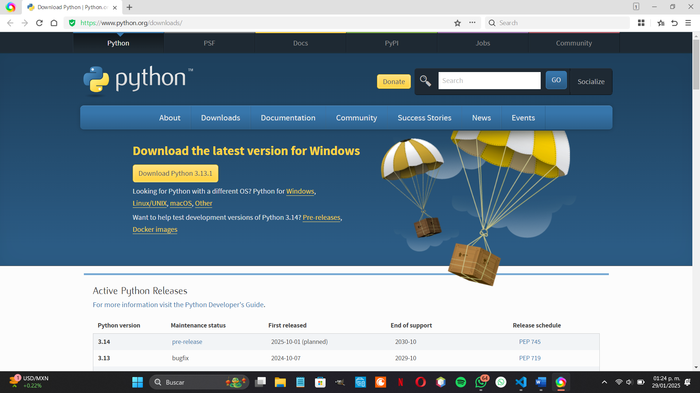

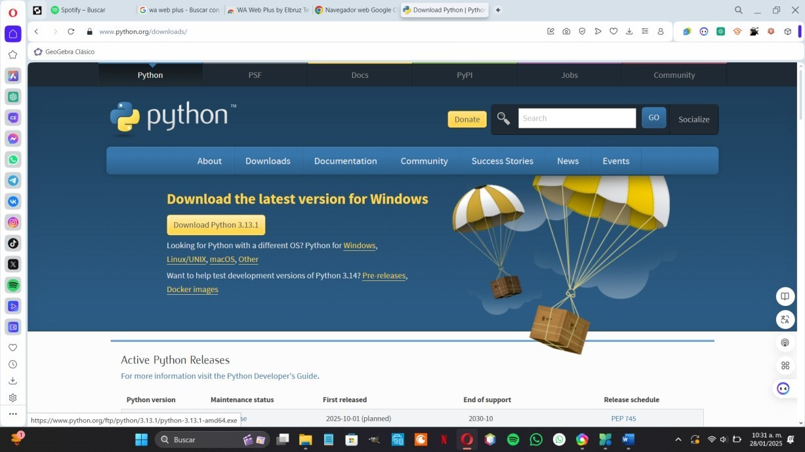

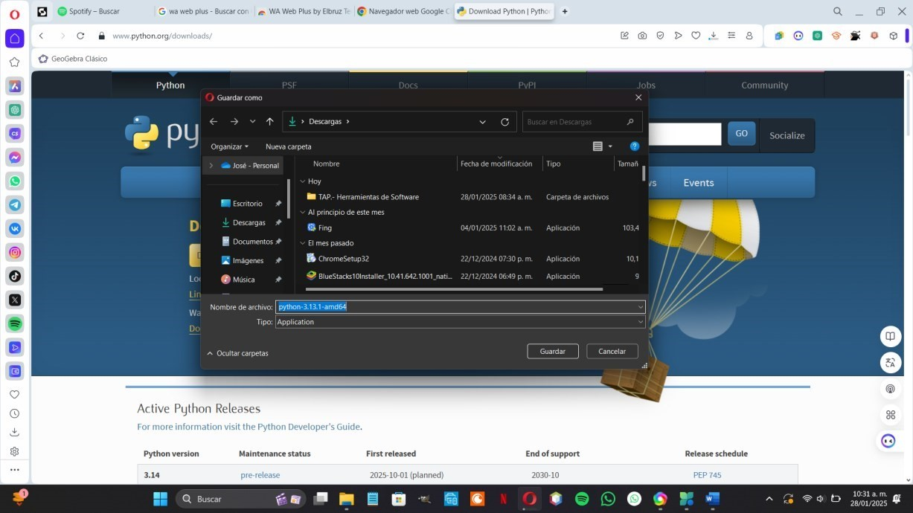

## **PASO 2**

2. 	Instalar Python: 

    * Hacer doble clic en el archivo de instalación para iniciar el proceso. Y seguir el orden conforme a las siguientes imágenes que se muestran justo abajo.

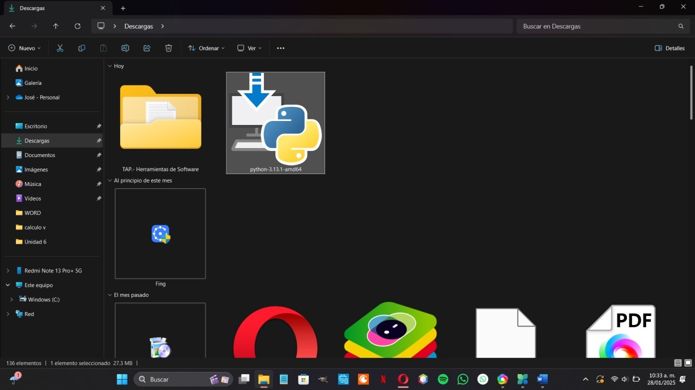

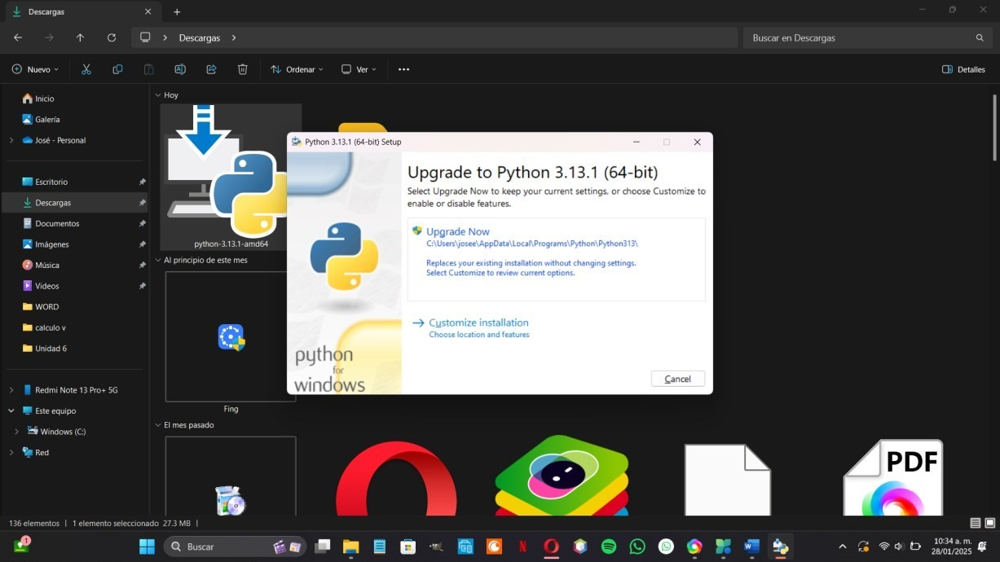

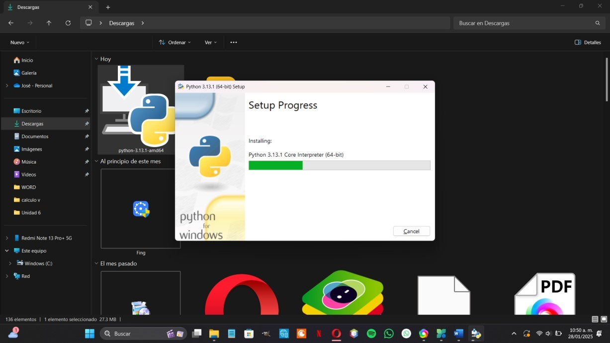

## **PASO 3 **
1. Configuración de Variables de Entorno:
 
    *	Presiona Windows y buscar en la pestaña de búsqueda
    y buscar “Editar las varíales del entorno del sistema”. 

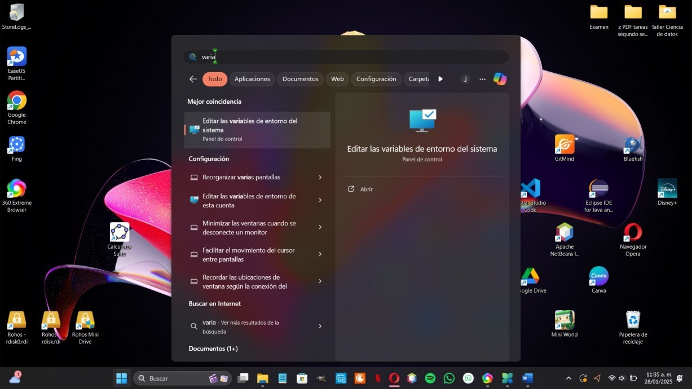

	Hacer un clic y se abrirá la ventana de "Propiedades del sistema". 

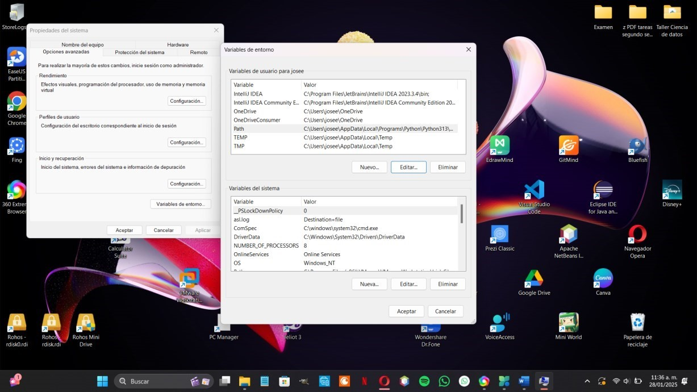

2.  Acceder a Variables de Entorno: 

    *	En la pestaña "Opciones avanzadas", haz clic en el botón "Variables de entorno". 

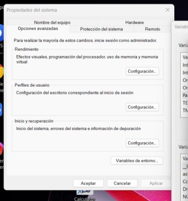

3.	Modificar la Variable Path:

    *	En la sección "Variables del sistema", busca la variable Path y selecciónala. 

    *	Haz clic en "Editar". 

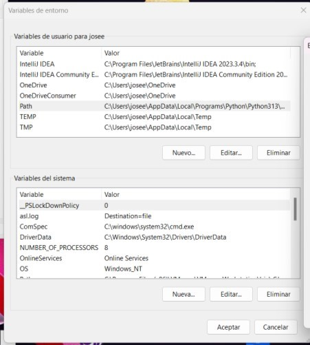

4.	Agregar la Ruta de la Herramienta: 

    *	Haz clic en "Nuevo" y agrega la ruta C:\Python. 
   
    *	Si ya existe una entrada similar, verifica que la ruta esté correctamente escrita. 

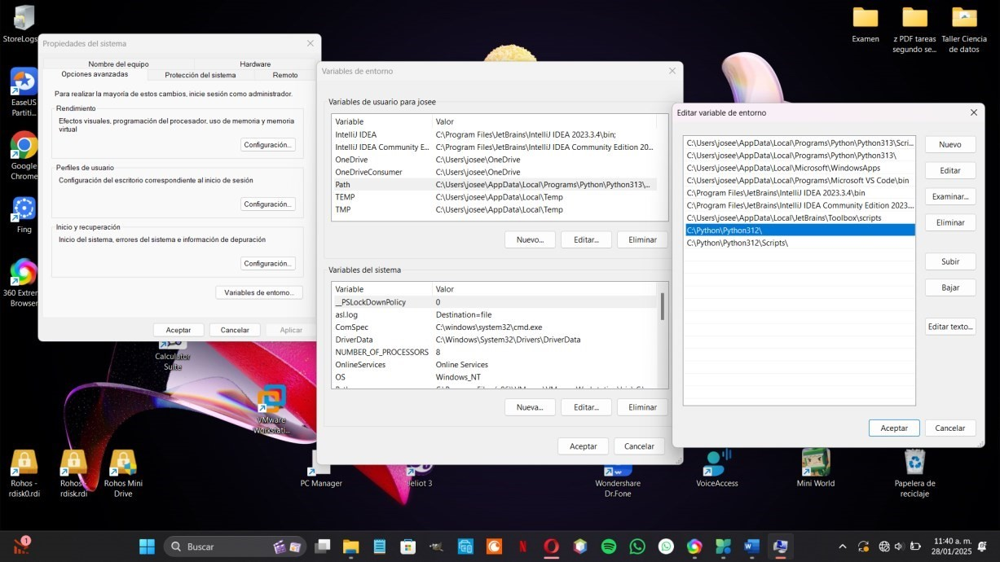

5.	Guardar los Cambios: 

    *	Haz clic en "Aceptar" en todas las ventanas para guardar los cambios. 

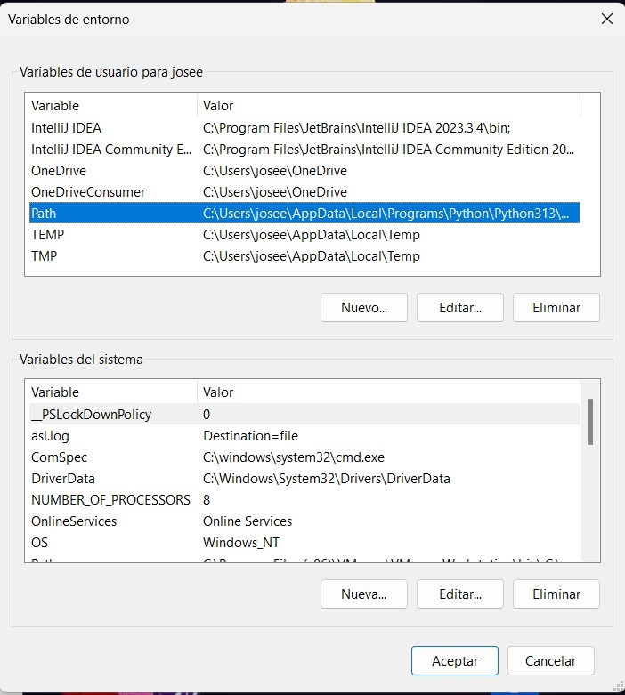

